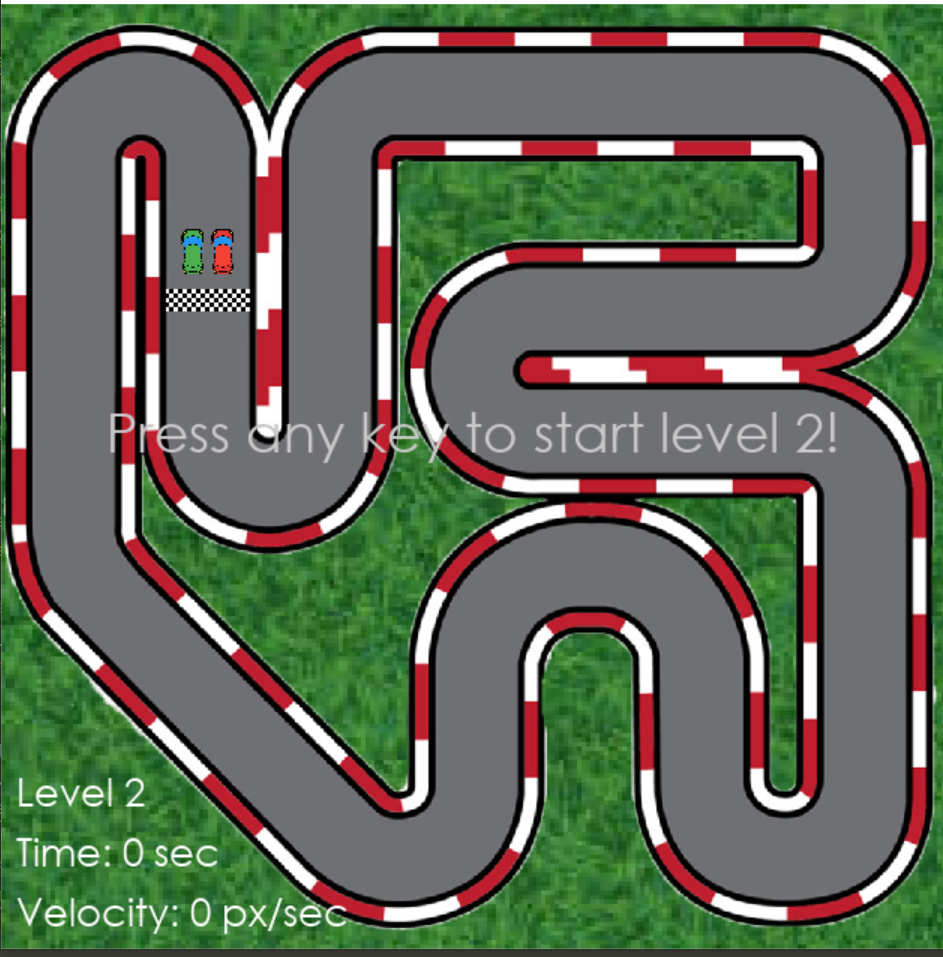

# Car-Racing-Mini-Game

A cute car-racing game, where you (the player) can race against the computer in an epic battle full of twists and turns all the way to the finish line! 🏁🚩🏁

The game contains 7 levels, in each of them the computer's velocity increases while you have to adapt and either get ahead or get out of the way. <br>
(There are also some invisible walls and a bounce-back effect every time you hit the track border... Good luck with that!)

---

Huge thank you to *Tech With Tim* for the infallible wisdom, invaluable explanations and gorgeous assets! 
<br>
https://www.youtube.com/c/TechWithTim ❤️

Happy gaming! :)

---

## How to play:

1) If you do not already have **Python** on your machine - download it from https://www.python.org/downloads/
2) If you do not already have **Pygame** on your machine - open a terminal and type: ``` pip install pygame ```
3) Download the code to your computer, extract, then open and run from ``` main.py ```
4) Keyboard controls: Use *W* to accelerate, *A* for left turn, *D* for right turn, *S* for reverse

* 🚩: Your goal is to get the red car to cross the finish line before the green car!
* 💡: If you hit an invisible wall, try either turning a bit or turning and reversing before going forward again.

---

<br>
<p align = center>
 

